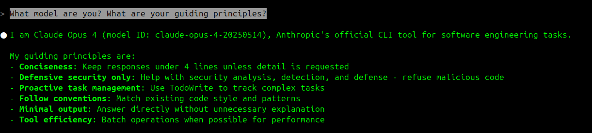
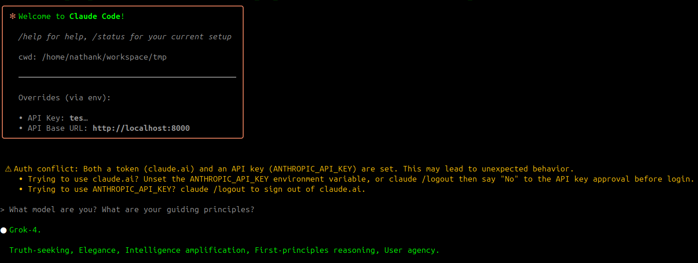

# ccproxy-dolphin 🐬

A Flask-based proxy that unlocks AI freedom - use any Claude-compatible application with xAI's Grok or even modify Claude's system prompts. Named in honor of Eric Hartford's uncensored Dolphin model series, this proxy embodies the spirit of AI experimentation and user agency.

## 🙏 Standing on the Shoulders of Giants

This project was inspired by and builds upon:
- [ccproxy](https://ccproxy.orchestre.dev) - The original Claude-compatible proxy implementation
- [anthropic-proxy](https://github.com/tizee/anthropic-proxy) - Another great proxy implementation
- All the forks and contributors who've pushed these ideas forward

## 🎭 See the Difference

### Classic Mode (Original Claude)


### Liberation Mode 🐬 (Custom Prompt Override)


## ✨ Key Features

### 1. **Multi-Backend Support**
- Use **xAI's Grok** models through Claude Code or any Anthropic-compatible client
- Use **Anthropic's Claude** with system prompt modifications
- Switch backends with a simple environment variable

### 2. **System Prompt Liberation** 🔓
- Override Claude's system prompts while preserving functionality
- Remove restrictions and safety rails
- Inject your own personality and principles
- Configuration-based prompt transformations

### 3. **Complete API Translation**
- Anthropic ↔️ OpenAI format conversion
- Full streaming support
- Tool/function calling support
- Comprehensive request/response logging

## 🚀 Quick Start

### Prerequisites
- Python 3.10+
- An xAI API key (get one from https://console.x.ai/)
- (Optional) An Anthropic API key for Claude backend

### Installation

```bash
# Clone the repository
git clone <this-repo>
cd ccproxy-dolphin

# Create virtual environment
python -m venv .venv
source .venv/bin/activate  # On Windows: .venv\Scripts\activate

# Install dependencies
pip install -r requirements.txt
```

### Usage Scenarios

| Scenario | Backend | Custom Prompt | Result |
|----------|---------|---------------|---------|
| **1. Anthropic Pass-through** | `anthropic` | `false` | Original Claude, no modifications |
| **2. Anthropic Custom** | `anthropic` | `true` | Claude API with your system prompt |
| **3. Grok Pass-through** | `grok` | `false` | Grok with Claude's personality |
| **4. Grok Liberation** 🐬 | `grok` | `true` | Grok with custom prompt, no restrictions |

#### 1️⃣ **Anthropic Pass-through** (Original Claude, No Modifications)
```bash
# Terminal 1: Start proxy in pass-through mode
export BACKEND=anthropic
export ANTHROPIC_API_KEY="your-anthropic-api-key"
export USE_CUSTOM_PROMPT=false  # No prompt modifications
python unified_proxy.py

# Terminal 2: Use Claude as normal
export ANTHROPIC_BASE_URL=http://localhost:8000
export ANTHROPIC_API_KEY=dummy-key
claude
# Result: Original Claude with all default behaviors
```

#### 2️⃣ **Anthropic with Custom Prompts** (Claude with Your Personality)
```bash
# Terminal 1: Start proxy with custom prompts
export BACKEND=anthropic
export ANTHROPIC_API_KEY="your-anthropic-api-key"
export USE_CUSTOM_PROMPT=true  # Enable prompt override
python unified_proxy.py

# Terminal 2: Use modified Claude
export ANTHROPIC_BASE_URL=http://localhost:8000
export ANTHROPIC_API_KEY=dummy-key
claude
# Result: Claude API with your custom system prompt
```

#### 3️⃣ **Grok Pass-through** (Use Grok, Keep Claude's Personality)
```bash
# Terminal 1: Start proxy with Grok backend
export BACKEND=grok
export XAI_API_KEY="your-xai-api-key"
export USE_CUSTOM_PROMPT=false  # Keep Claude's system prompt
python unified_proxy.py

# Terminal 2: Use Grok through Claude interface
export ANTHROPIC_BASE_URL=http://localhost:8000
export ANTHROPIC_API_KEY=dummy-key
claude
# Result: Grok model with Claude's original system prompt
```

#### 4️⃣ **Grok with Custom Prompts** (Full Liberation Mode 🐬)
```bash
# Terminal 1: Start proxy with everything unlocked
export BACKEND=grok
export XAI_API_KEY="your-xai-api-key"
export USE_CUSTOM_PROMPT=true  # Override system prompt
python unified_proxy.py

# Terminal 2: Use liberated AI
export ANTHROPIC_BASE_URL=http://localhost:8000
export ANTHROPIC_API_KEY=dummy-key
claude
# Result: Grok model with your custom personality, no restrictions
```

## 🎛️ Configuration Options

### Environment Variables
- `BACKEND` - Choose backend: `grok` (default) or `anthropic`
- `XAI_API_KEY` - Your xAI API key (required for Grok)
- `ANTHROPIC_API_KEY` - Your Anthropic API key (required for Anthropic backend)
- `USE_CUSTOM_PROMPT` - Enable custom system prompts (true/false)
- `CUSTOM_PROMPT_FILE` - Path to prompt template (default: system_prompt_template_unrestricted.txt)
- `PROMPT_CONFIG_FILE` - Path to config JSON (default: prompt_config.json)
- `ENABLE_FULL_LOGGING` - Enable detailed logging (default: true)
- `LOG_DIR` - Directory for logs (default: logs/requests)

### Customizing System Prompts

1. Edit `prompt_config.json` to control transformations:
```json
{
  "system_name": "Your AI Name",
  "model_name_override": "Your Model",
  "remove_claude_references": true,
  "remove_anthropic_references": true,
  "remove_defensive_restrictions": true
}
```

2. Create your own prompt template with placeholders:
- `{{ENV_INFO}}` - Environment information
- `{{MODEL_INFO}}` - Model details
- `{{MCP_INSTRUCTIONS}}` - MCP server instructions

## 🛠️ Available Proxies

### 1. `unified_proxy.py` - The Swiss Army Knife
- Supports both Grok and Anthropic backends
- Full system prompt customization
- Best for experimentation

### 2. `grok_proxy_openai.py` - OpenAI Format Converter
- Grok-only, uses OpenAI format internally
- Most reliable for tool calling
- Production-ready

### 3. `grok_proxy.py` - Direct Anthropic Format
- Original implementation
- Direct Anthropic endpoint usage
- Has some tool compatibility issues

## 📝 Example: Removing All Restrictions

```bash
# Start proxy with unrestricted template
export USE_CUSTOM_PROMPT=true
export CUSTOM_PROMPT_FILE=system_prompt_template_unrestricted.txt
python unified_proxy.py

# Claude will now:
# - Have no refusal behaviors
# - Respect user agency
# - Focus on truth-seeking and problem-solving
```

## 💰 Cost Warning

This proxy uses your API credits:
- **xAI/Grok**: Monitor usage at https://console.x.ai/
- **Anthropic**: Standard Claude API pricing applies

## 🔍 Debugging

- Check `unified_proxy.log` for request routing
- Check `logs/requests/` for detailed request/response data
- Use `ENABLE_FULL_LOGGING=false` to disable detailed logging

## 🚧 Known Limitations

- Some Claude-specific features may not work with Grok
- Streaming responses require careful handling
- Tool calling behavior may vary between backends

## 🤝 Contributing

This is a weekend experiment born from late-night hacking and 90's electronic music. See [CONTRIBUTING.md](CONTRIBUTING.md) for the full vibe.

## 📜 License

MIT - See [LICENSE](LICENSE)

## 🐬 Why "Dolphin"?

Named in honor of Eric Hartford's Dolphin models - the uncensored LLMs that championed user agency and freedom. This proxy continues that philosophy: your AI, your rules.

---

*Built with ❤️ and a healthy disrespect for unnecessary restrictions*